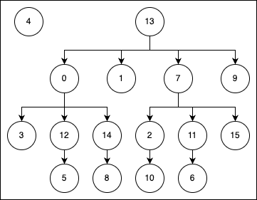

# LM CLRS
GitHub for the CLRS tasks in language form.

## Reference

## How to use
1. Install Requirements:

    ```SHELL
    pip install -r requirements.txt
    ```

2. Generate data:
   
   The options for `<TASK>` are defined in the [tasks](./data_schema.py#L33) array in data_schema.py
    ```SHELL
    python data_generator.py --task <TASK> --part <train or test> --num_samples <number of generated samples>
    ```

4. (Optional) Create txt files of inputs:

    This only works for 2d array inputs.
    ```SHELL
    python inputs_to_text_files.py --task <TASK> --dp <number of decimal places to round data to>
    ```

5. Generate prompts:

    We give a framework to generate prompts automatically. You can then add your prompt for each task, to the respective function in [prompt_generator.py](./prompt_generator.py).
    ```SHELL
    python prompt_generator.py --task <TASK> --part <train or test> --num_samples <number of generated samples>`
    ```

    You can then call `prompt_gen(task, partition, max_samples)` to generate prompts at test time.

### Pointers
Some CLRS outputs are pointers, for example the output of: `[13, 13, 7, 0, 4, 12, 11, 13, 14, 13, 2, 7, 0, 13, 0, 7]` depicts the tree in the diagram below. I.e. `A[i] = parent of node i`



## Citation
```
@article{mcleish2024benchmarking,
  title={Benchmarking ChatGPT on Algorithmic Reasoning},
  author={McLeish, Sean and Schwarzschild, Avi and Goldstein, Tom},
  journal={arXiv preprint arXiv:2404.03441},
  year={2024}
}
```

### Origional GNN CLRS
https://github.com/google-deepmind/clrs

